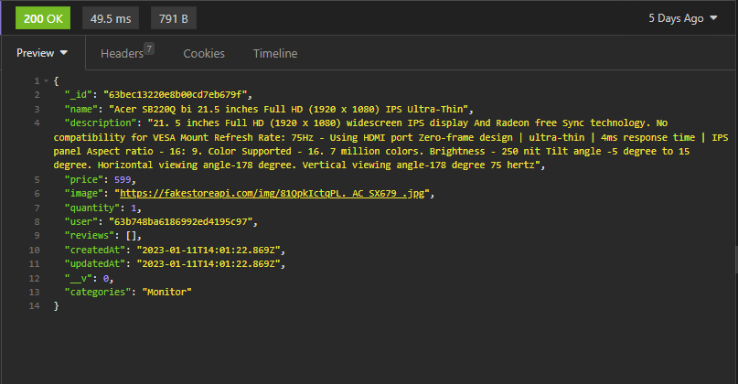

# Project3 MERN E-Commerce

## Description
This e-commerce website is a complete stack application built using the MERN stack, comprising Mongoose, Express, React, and Node. Users can navigate through the website, add items to their cart, and complete purchases. Users can also register and log in. As an admin, one can create new products. The website is deployed on Netlify, and the API on fly.io. The Back-end uses MongoDB Atlas to store data in the database.

## Getting Started

The project can be accessed on **[my GitHub profile on ecommerce-frontend repository,](https://github.com/scarlosteixeira/ecommerce-frontend)** **[and the Back-end on the ecommerce-api repository.](https://github.com/scarlosteixeira/ecommerce-api)** The application can be accessed on **[Netlify](https://ecommerce-project3.netlify.app/)** <br>
This project is open source and can be downloaded, used and modified by anyone, as far as credit is given.

The project was made in a group of two, to be completed within 11 days, where I have been responsible for the Back-end and my partner, **[AlishanKably,](https://github.com/AlishanKably/Project-03)** for the Front-end. The project is split as it follows: <br>

1. 2 days of whiteboarding and singing off.
2. 5 days for research, development and coding.
3. 2 days to get a minimum viable project.
4. 1 day for polishing, bug fixing.
5. 1 day to present the completed project.

## Technologies Used
### Front-end
* **[Axios](https://www.npmjs.com/package/axios)**
* **[Bulma](https://bulma.io/)**
* **[Google Chrome](https://www.google.com/chrome/)**
* **[HTML 5](https://developer.mozilla.org/en-US/docs/Web/HTML)**
* **[Netlify](https://docs.netlify.com/)**
* **[React](https://reactjs.org/)**
* **[React DOM](https://reactjs.org/docs/react-dom.html)**
* **[react-router-dom](https://github.com/remix-run/react-router#readme)**
* **[VS Code](https://code.visualstudio.com/docs)**
* **[TypeScript](https://www.typescriptlang.org/docs/home.html)**


### Back-end
* **[bcrypt](https://www.npmjs.com/package/bcrypt)**
* **[cors](https://www.npmjs.com/package/cors)**
* **[dotenv](https://www.npmjs.com/package/dotenv)**
* **[Express](https://expressjs.com/en/starter/installing.html)**
* **[express-mongo-sanitize](https://www.npmjs.com/package/express-mongo-sanitize)**
* **[fly.io](https://fly.io/docs/getting-started/)**
* **[Git / GitHub](https://docs.github.com/en)**
* **[http-status-codes](https://www.npmjs.com/package/http-status-codes)**
* **[insomnia](https://docs.insomnia.rest/)**
* **[jsonwebtoken](https://www.npmjs.com/package/jsonwebtoken)**
* **[MongoDB Atlas](https://docs.atlas.mongodb.com/)**
* **[Mongoose](https://mongoosejs.com/docs/guide.html)**
* **[mongoose-hidden](https://www.npmjs.com/package/mongoose-hidden)**
* **[mongoose-unique-validator](https://www.npmjs.com/package/mongoose-unique-validator)**
* **[Node.js](https://nodejs.org/en/docs/)**
* **[validator](https://www.npmjs.com/package/validator)**

### Side Tools
* **[Jira](https://www.atlassian.com/software/jira)**
* **[Escalidraw](https://github.com/excalidraw/excalidraw#documentation)**


## Brief

* Work in a team, using **git to code collaboratively**.
* **Build a full-stack application** by making a backend/frontend.
* **Use an Express API** to serve your data from a Mongo database.
* **Consume your API with a separate front-end** built with React.
* **Be a complete product** which most likely means multiple relationships and CRUD functionality for at least a couple of models.
* **Be deployed online** so it's publicly accessible.
* **Have automated tests** for _at least_ one RESTful resource on the back-end.

## Planning

We started the project by planning the tasks and features we wanted to implement. We then split the tasks between us, me working on the Back-end and Alishan working on the Front-end. We used **[Jira](https://www.atlassian.com/software/jira)** to keep track of our progress and tasks.


For code management, we utilized **[GitHub,](https://docs.github.com/en)** Given that we were working on different project aspects, we didn't have many conflicts, but when we were polishing and addressing bugs, we collaborated on the front-end and some conflicts did occur.

The Back-end development began with the modeling of the database models and their relationships. Once the models were finalized, we proceeded to work on the routes.


```TypeScript
const router = express.Router()

router.route('/test').get((req: Request, res: Response) => {
  res.send('Test successful')
  console.log('Test successful')
})

//user endpoints

router.route('/signup').post(signup)
router.route('/login').post(login)
router.route('/seller/signup').post(sellerSignup)
router.route('/user').get(secureRoute, getCurrentUser)

// product endpoints
router.route('/products').get(getProducts)
router.route('/product/:productId')
  .get(getProduct)
  .put(secureRoute, updateProduct)
  .delete(secureRoute, deleteProduct)
router.route('/addproduct').post(secureRoute, addProduct)

//comments endpoints
router.route('/product/:productId/comment').post(secureRoute, addComment)
router.route('/product/:productId/comment/:commentId')
  .put(secureRoute, updateComment)
  .delete(secureRoute, deleteComment)

//cart endpoints
router.route('/cart').get(secureRoute, getCart)
router.route('/product/:productId/cart')
.post(secureRoute, addProductsToCart)
.put(secureRoute, updateProductsToCart)
.delete(secureRoute, deleteCartProducts)
router.route('/cart/:cartId').delete(secureRoute, deleteCart)

// order endpoints
router.route('/order').get(secureRoute, getOrder)
router.route('/cart/:cartId/order').post(secureRoute, addOrder)
```

## Build/Code Process
### Back-end

To build the back-end, I adopted the Model-View-Controller (MVC) approach, which comprises three main components: the Model, the View, and the Controller. The Model represents the data layer and handles data management and organisation. The View represents the presentation layer and is responsible for the user interface through the API routes. Finally, the Controller represents the logic layer and manages the application's business logic and the flow of data between the Model and the View.

I began the development process by working on the models and their respective relationships. During this phase, I simultaneously worked on the seed file to test the models and populate the database.
  
  * This is the product model:

``` TypeScript
    export const productSchema = new mongoose.Schema(
    {
      name: { type: String, required: [true, 'Enter a valid name'] },
      description: { type: String },
      price: { type: Number, required: [true, 'Enter a price']
      },
      categories: { type: String },
      image: { type: String },
      quantity: { type: Number, required: [true, 'Enter a quantity'] },
      reviews: [reviewSchema],
      user: { type: mongoose.Schema.Types.ObjectId, ref: 'User', required: true }
    },
    { timestamps: true }
  )
  export default mongoose.model('Product', productSchema)
```
After finishing the model layer, the next step was to create the routes. Although creating most of the routes was simple, some of them required authentication. In order to achieve this, a middleware was created to handle all routes that required authentication. When a user logs in, a token is generated and stored in the local storage. When the user makes a request to a protected route, the token is sent in the header. The middleware then verifies the token using the jsonwebtoken package. If the token is valid, the user is allowed to access the route. If the token is invalid, an error message is returned. This process helps to secure the routes that require authentication.

``` TypeScript
  export default function secureRoute( req: Request, res: Response, next: NextFunction) {
  const rawToken = req.headers.authorization
  if (!rawToken) {
    return res
      .status(StatusCodes.UNAUTHORIZED)
      .json({ message: 'Unauthorized' })
  }
  const token = rawToken.replace('Bearer ', '')
  jwt.verify(token, secret, async (err, payload) => {
    if (err || !payload) {
      return res
        .status(StatusCodes.UNAUTHORIZED)
        .json({ message: 'Unauthorized' })
    }
    const jwtPayload = payload as JwtPayload
    const user = await Users.findById(jwtPayload.userId)
    if (!user) {
      return res
        .status(StatusCodes.UNAUTHORIZED)
        .json({ message: 'Unauthorized' })
    }
    req.currentUser = user
    next()
  })
}
```
Using the express-mongo-sanitize package to prevent NoSQL injection attacks is a good practice for ensuring safety and security. This package helps to sanitize the request body, query string, and params by removing any dollar signs ($) and dots (.) that could be used to inject malicious code into the database. By implementing this package as a middleware in the app.ts file, I have taken an important step towards protecting my application from potential attacks.

``` TypeScript
  app.use(mongoSanitize())
```

I made sure to prioritise safety and security when building the user model layer. To protect sensitive data like passwords, emails, and mobile numbers, I utilised the mongoose-hidden package. This allowed me to hide the sensitive data, thus preventing malicious users from accessing it. Additionally, I used the bcrypt package to hash passwords before storing them in the database. This further secured the sensitive information and prevented unauthorised access.

``` TypeScript
  password: {
    type: String,
    required: [true, 'Password is required'],
    // ! Multiple validators, for different types of error messages on the password
    validate: [
      {
        message: 'Password must be at least 8 characters in length.',
        validator: (password: string) => password.length >= 8
      },
      {
        message:
          'Password must contain at least 1 lowercase character, uppercase character, and symbol.',
        validator: (password: string) =>
          validator.isStrongPassword(password, {
            minLowercase: 1,
            minUppercase: 1,
            minSymbols: 1,
            minNumbers: 1
          })
      }
    ]
  }

userSchema.pre('save', function hashPassword(next) {
  this.password = bcrypt.hashSync(this.password, bcrypt.genSaltSync())
  next()
})

``` 
``` TypeScript
  userSchema.plugin(
  mongooseHidden({ defaultHidden: { password: true, email: true, _id: true, mobile: true } })
  )
```

I personally utilised Insomnia to test the API routes, which helped me confirm that each route was working as intended. Insomnia also provided me with a detailed look into the response from the server, and allowed me to closely examine how the Back-end was handling the request and its elements, including the body, params, and the authorization header.

When testing the "get Product" route, I simply needed to provide the product ID as a parameter in the URL, no Bearer authorization token was necessary. The resulting response was a JSON object containing the relevant product data.




When testing the "add-product" route using Insomnia, I had to provide the product data in the body, and an authorization header was required to ensure that only authenticated users with seller credentials (```isSeller```) could add products. The resulting response was a JSON object containing the product data that was added to the database.


### Front-end
We utilized multiple React components to create the frontend, where each component contained an async function that fetched the API routes. For instance, we used the ```useEffect()``` hook to display individual products available on the online store by fetching their unique IDs. Below is an example of how we achieved this:

``` TypeScript
React.useEffect(() => {
    async function fetchProducts() {
      const resp = await fetch(`${baseUrl}/product/${productId}`)
      const ProductsData = await resp.json()
      updateProducts(ProductsData)
      console.log(ProductsData);
      
    }
    fetchProducts()
  }, [])
```
To authorise users to perform more functions on the app, we created log in and sign up components that allowed the user to create an account through a sign-up and log-in process. After successfully logging in, the user was redirected to the home page, where the available products were shown. This was done by mapping over the individual products and rendering them as cards on the home screen. By clicking on a card, the user could see an expanded description of the product and add it to their cart using the following function:

```TypeScript
async function handleAddToCart(e: SyntheticEvent) {
    e.preventDefault()
    try {
      const token = localStorage.getItem('token')
      const { data } = await axios.post(`${baseUrl}/product/${productId}/cart`, productId, 
      {headers: { Authorization: `Bearer ${token}` }
      
    })
      console.log(productId, userId)
      navigate('/')
    } catch (err: any) {
      setErrorMessage(err.response.data.message)
    }
  }
```
This function posted the chosen product to the cart database. Once the user completed browsing the products and adding them to the **cart**, they could navigate to the **cart** tab and see the products they had selected using the following code:

```TypeScript
async function updateCart() {
    try {
      const token = localStorage.getItem('token')
      const { data } = await axios.get(`${baseUrl}/cart`, {
        headers: { Authorization: `Bearer ${token}` }
      })
      updateCarts(data)
    } catch (err: any) {
      setErrorMessage(err.response.data.message)
    }
  }

useEffect(() => {
  updateCart()
}, [])
```


Furthermore, we used a function to calculate the total price of all products in the cart:

``` Typescript
const sumArr = [] as Array<number>
let reducedArr: number = 0
<div className="is-flex-direction-row">
          {Carts[0].products?.map(product => {
            console.log(product)
            sumArr.push(product.quantity * Number(product.product.price))
            console.log(sumArr);
            reducedArr = sumArr.reduce((acc, current) => {
              return acc + current
            })
            console.log(reducedArr)
```

Finally, we linked each component to an interface that described the type of each prop, as shown in the following example:

```TypeScript
export interface IOrder{
  amount: String,
  status: String,
  cart: ICart,
  user: { username: string }
}
```


## Challenges
We faced our first challenge in working collaboratively on the same project, but we overcame it with effective planning and communication. To keep track of tasks and progress, we utilised Jira, while Git helped us track changes and conflicts. We also made use of branches to prevent conflicts.

Our second challenge was designing the database to avoid data duplication. To achieve this, I used references and data population. For instance, when a product is added to the cart, an array of product ids is created instead of storing the product data. To obtain the product data, we can use the product id to retrieve it from the product collection. You can view below how the cart is structured in the database, the response, and how I populated the product data.

``` TypeScript
const cart = await Cart.find({ user: [currentUser] }).populate({path:'products.product'})
```

 

```JSON
[
	{
		"_id": "640e43cb5b400f619d7b35e6",
		"user": "63b748ba6186992ed4195c97",
		"products": [
			{
				"product": {
					"_id": "63b748ba6186992ed4195ca2",
					"name": "ryzen 5 5600X",
					"price": 170,
					"quantity": 1,
					"user": "63b748ba6186992ed4195c97",
					"reviews": [
						{
							"comment": "nice upgrade for my old R5 1600",
							"rating": 5,
							"user": "63b748ba6186992ed4195c97",
							"_id": "63b98b6560c3b3844943c8fe",
							"createdAt": "2023-01-07T15:10:29.057Z",
							"updatedAt": "2023-01-07T15:10:29.057Z"
						},
						{
							"comment": "nice upgrade for my old R5 1600",
							"rating": 5,
							"user": "63b748ba6186992ed4195c97",
							"_id": "63b991696e6bd0cf53d32266",
							"createdAt": "2023-01-07T15:36:09.408Z",
							"updatedAt": "2023-01-07T15:36:09.408Z"
						},
						{
							"comment": "nice upgrade for my old R5 1600",
							"rating": 5,
							"user": "63b748ba6186992ed4195c97",
							"_id": "63b991a271a98ccc95377556",
							"createdAt": "2023-01-07T15:37:06.314Z",
							"updatedAt": "2023-01-07T15:37:06.314Z"
						}
					],
					"createdAt": "2023-01-05T22:01:30.655Z",
					"updatedAt": "2023-01-07T15:37:06.315Z",
					"__v": 3,
					"image": "https://www.laptop.lk/wp-content/uploads/2022/01/AMD-Ryzen-5-5600X-Processor-01-1.jpg",
					"categories": "CPU"
				},
				"quantity": 1,
				"_id": "640e43cb5b400f619d7b35e7"
			},
			{
				"product": {
					"_id": "63bebdd520e8b00cd7eb677f",
					"name": "WD 2TB Elements Portable External Hard Drive - USB 3.0",
					"description": "USB 3.0 and USB 2.0 Compatibility Fast data transfers Improve PC Performance High Capacity; Compatibility Formatted NTFS for Windows 10, Windows 8.1, Windows 7; Reformatting may be required for other operating systems; Compatibility may vary depending on user’s hardware configuration and operating system",
					"price": 64,
					"image": "https://fakestoreapi.com/img/61IBBVJvSDL._AC_SY879_.jpg",
					"quantity": 1,
					"user": "63b748ba6186992ed4195c97",
					"reviews": [],
					"createdAt": "2023-01-11T13:47:01.018Z",
					"updatedAt": "2023-01-11T13:47:01.018Z",
					"__v": 0,
					"categories": "HDD/SSD"
				},
				"quantity": 1,
				"_id": "641220888a9ac9c06bb36e3b"
			}
		],
		"isCheckedOut": true,
		"createdAt": "2023-03-12T21:27:39.613Z",
		"updatedAt": "2023-03-15T19:46:16.156Z",
		"__v": 5
```

The implementation of this structure is made possible through the use of references and data population. As a result, it not only helps to reduce the amount of space required for storing data in the database, but also makes it easier to manage both the data structure and the data itself.

However, I encountered some difficulties when working with the data structure and data population in the order controller. Specifically, I needed to populate data from both the cart and product collections, which I addressed through the use of nested population. While the method remained the same, I needed to pass the path of the data to be populated (cart), the nested path of the data to be populated (product), and the model for the nested data. 

``` TypeScript
const order = await Order.find({user: [currentUser] }).populate('user').populate({path:'cart', populate:{path: 'products.product', model:'Product'}})
```


```JSON 
[
	{
		"_id": "640e43d15b400f619d7b35fb",
		"user": {
			"username": "carlos",
			"isSeller": true
		},
		"cart": {
			"_id": "640e43cb5b400f619d7b35e6",
			"user": "63b748ba6186992ed4195c97",
			"products": [
				{
					"product": {
						"_id": "63b748ba6186992ed4195ca2",
						"name": "ryzen 5 5600X",
						"price": 170,
						"quantity": 1,
						"user": "63b748ba6186992ed4195c97",
						"reviews": [
							{
								"comment": "nice upgrade for my old R5 1600",
								"rating": 5,
								"user": "63b748ba6186992ed4195c97",
								"_id": "63b98b6560c3b3844943c8fe",
								"createdAt": "2023-01-07T15:10:29.057Z",
								"updatedAt": "2023-01-07T15:10:29.057Z"
							},
							{
								"comment": "nice upgrade for my old R5 1600",
								"rating": 5,
								"user": "63b748ba6186992ed4195c97",
								"_id": "63b991696e6bd0cf53d32266",
								"createdAt": "2023-01-07T15:36:09.408Z",
								"updatedAt": "2023-01-07T15:36:09.408Z"
							},
							{
								"comment": "nice upgrade for my old R5 1600",
								"rating": 5,
								"user": "63b748ba6186992ed4195c97",
								"_id": "63b991a271a98ccc95377556",
								"createdAt": "2023-01-07T15:37:06.314Z",
								"updatedAt": "2023-01-07T15:37:06.314Z"
							}
						],
						"createdAt": "2023-01-05T22:01:30.655Z",
						"updatedAt": "2023-01-07T15:37:06.315Z",
						"__v": 3,
						"image": "https://www.laptop.lk/wp-content/uploads/2022/01/AMD-Ryzen-5-5600X-Processor-01-1.jpg",
						"categories": "CPU"
					},
					"quantity": 1,
					"_id": "640e43cb5b400f619d7b35e7"
				},
				{
					"product": {
						"_id": "63bebdd520e8b00cd7eb677f",
						"name": "WD 2TB Elements Portable External Hard Drive - USB 3.0",
						"description": "USB 3.0 and USB 2.0 Compatibility Fast data transfers Improve PC Performance High Capacity; Compatibility Formatted NTFS for Windows 10, Windows 8.1, Windows 7; Reformatting may be required for other operating systems; Compatibility may vary depending on user’s hardware configuration and operating system",
						"price": 64,
						"image": "https://fakestoreapi.com/img/61IBBVJvSDL._AC_SY879_.jpg",
						"quantity": 1,
						"user": "63b748ba6186992ed4195c97",
						"reviews": [],
						"createdAt": "2023-01-11T13:47:01.018Z",
						"updatedAt": "2023-01-11T13:47:01.018Z",
						"__v": 0,
						"categories": "HDD/SSD"
					},
					"quantity": 1,
					"_id": "641220888a9ac9c06bb36e3b"
				}
			],
			"isCheckedOut": true,
			"createdAt": "2023-03-12T21:27:39.613Z",
			"updatedAt": "2023-03-15T19:46:16.156Z",
			"__v": 5
		},
		"amount": 170,
		"status": "pending",
		"createdAt": "2023-03-12T21:27:45.287Z",
		"updatedAt": "2023-03-12T21:27:45.287Z",
		"__v": 0
	}
]
```
## Wins

To allow a user to sign up as a "seller" using the same interface as a "buyer," I created a new route specifically for it. This route is not available on the navbar or any other page, so users have to know the route to access it. This way, even if a user attempts to change the role on the body of the request for customer sign-up, it won't work due to back-end restrictions.

``` TypeScript
//customer sign up route
<Route path="/signup" element={<Signup />} />
//seller sign up route
<Route path="/seller/signup" element={<SellerSignup />} />
```
**Customer sign up screen**


---

**Seller sign up screen**


**Back-end restrictions for customer sign up**

I used the following code to check if the user is trying to assign ```true``` to the ```isSeller``` key  in the request body. If so, it will throw an error. This way, even if a user attempts to change the role on the body of the request for customer sign-up, it won't work due to back-end restrictions.

``` TypeScript
    // checks if the user password and password confirmation match and if the request.body.isSeller is false. If so, it creates a new user.
    if (checkPasswords(req.body.password, req.body.passwordConfirmation) && !req.body.isSeller) {
      const user = await User.create(req.body)
      res.send(user)
    } else {
      return res.status(StatusCodes.UNPROCESSABLE_ENTITY).send(
        { message: "Passwords don't match", errors: { password: "Passwords don't match" } }
      )
    }
```


On the other hand, if the user assigns ```false``` to the ```isSeller``` key, it will sign up as expected.


## Key Learnings/Takeaways

Through this project, I was able to develop a better understanding of Back-end MVC architecture and database design. I also gained knowledge on implementing best practices for protecting sensitive user information and preventing security breaches. Additionally, the integration of the Back-end and Front-end helped me build confidence in using standard fetch requests and Axios to make API calls.

## Bugs

Nothing to report.

## Future Features

- Add a search bar to search for products by name.
- Add filters to search for products by many different criteria.
- Use bootstrap instead of Bulma. I dealt with a lot of styling issues with Bulma, and I think bootstrap would be a better choice for this project.
- Make the app mobile first.
- Style the order page to be more user friendly.
- Add more functionality to all the pages to make the app more user friendly.
- Add tests for the Back-end.

